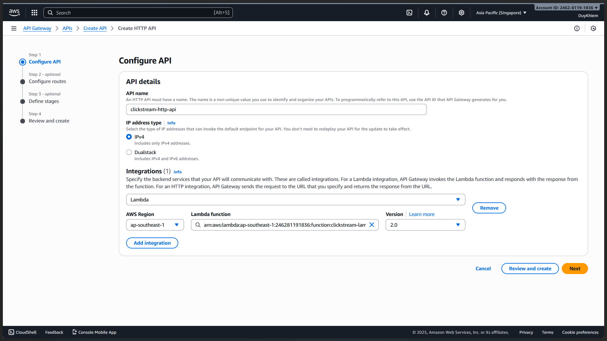
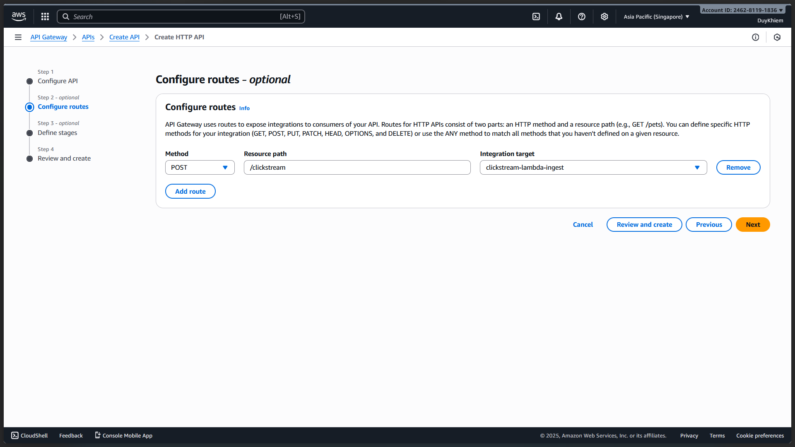
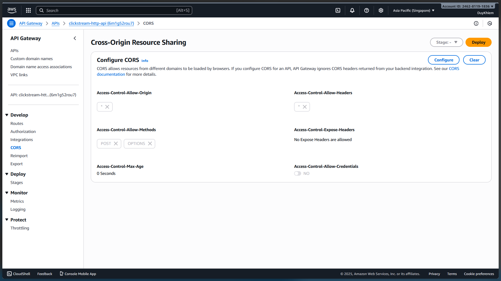
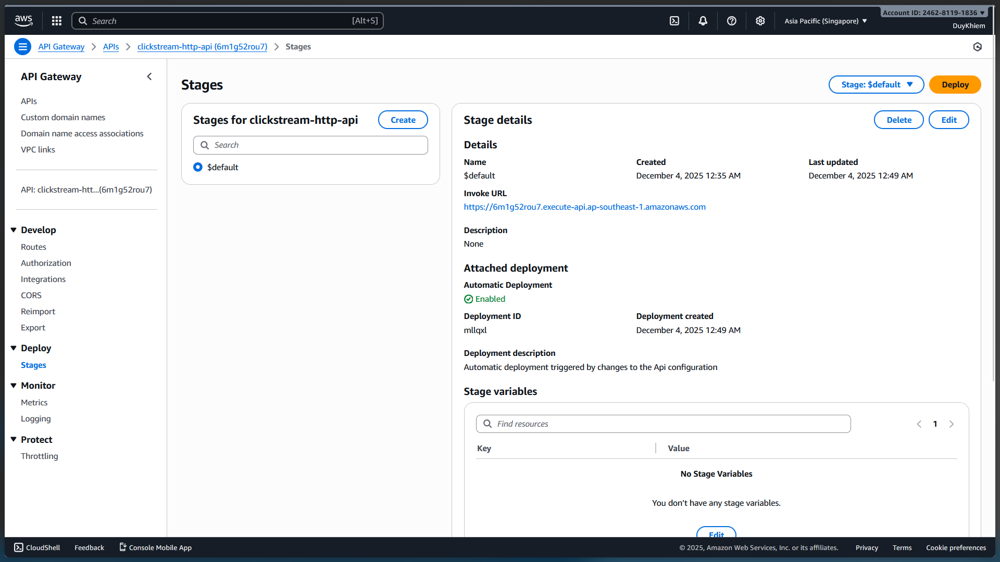

# 📘 **API Gateway — Clickstream Ingestion**

HTTP API v2 → Lambda Ingest → S3 Raw

This API handles clickstream ingestion from the frontend and forwards events to the Lambda ingest function.

---

# **1. API Specification**

| Component       | Value                                                                   |
| --------------- | ----------------------------------------------------------------------- |
| **API type**    | HTTP API (v2)                                                           |
| **API name**    | `clickstream-http-api`                                                  |
| **Route**       | `POST /clickstream`                                                     |
| **Integration** | Lambda → `clickstream-lambda-ingest`                                    |
| **Stage**       | `$default` (Auto-deploy: enabled)                                       |
| **CORS**        | Enabled (Allow `*`)                                                     |
| **Invoke URL**  | `https://<api-id>.execute-api.ap-southeast-1.amazonaws.com/clickstream` |

---

# **2. Create HTTP API (Console – UI)**

## **Step 1 — Create API**

1. AWS Console → API Gateway → **Create API**
2. Choose:

   ```
   HTTP API → Build
   ```

---

## **Step 2 — API Details**

In **Configure API** screen:

* **API name:**

  ```
  clickstream-http-api
  ```
* **IP address type:**

  ```
  IPv4
  ```
---

## **Step 3 — Add Integration**

Still on Configure API:

1. Under **Integrations**, choose:

   * **Integration type:** `Lambda`
   * **AWS Region:** `ap-southeast-1`
   * **Lambda function:** `clickstream-lambda-ingest`
   * **Version:** `2.0`

Click **Next**.


---

## **Step 4 — Configure Route**

On **Configure routes** screen:

1. Click **Add route**
2. Fill:

   ```
   Method: POST
   Route: /clickstream
   Integration: clickstream-lambda-ingest
   ```

Click **Next**.


---

## **Step 5 — Configure CORS**

1. Enable:

   ```
   Enable CORS: ON
   ```

2. Set:

   ```
   Access-Control-Allow-Origin: *
   Access-Control-Allow-Headers: *
   Access-Control-Allow-Methods: POST, OPTIONS
   ```

Click **Next**.



---

## **Step 6 — Stage Deployment**

On **Define stages**:

* **Stage name:**

  ```
  $default
  ```
* **Auto-deploy:**

  ```
  Enabled
  ```

Click **Create**.


---

# **3. Retrieve Invoke URL**

After creation:

1. In left menu → **Stages**
2. Select:

   ```
   $default
   ```
3. Copy the **Invoke URL**, e.g.:

```
https://6m1g52rou7.execute-api.ap-southeast-1.amazonaws.com
```

Full clickstream endpoint:

```
POST https://<api-id>.execute-api.ap-southeast-1.amazonaws.com/clickstream
```

---

# **4. Test the API**

## **Using curl**

```bash
curl -X POST \
  -H "Content-Type: application/json" \
  -d '{"eventName": "curl_test", "userId": "u-1"}' \
  https://<api-id>.execute-api.ap-southeast-1.amazonaws.com/clickstream
```

## Expected response:

```json
{"success": true}
```

## Verify S3:

File must appear at:

```
events/YYYY/MM/DD/HH/event-<uuid>.json
```

---

# **5. Notes**

* HTTP API v2 **always** uses Lambda proxy integration → no mapping templates needed.
* Route `/clickstream` must match what Lambda expects from `event.requestContext.http.path`.
* Stage `$default` is recommended because:

  * No need for manual deploy
  * Used for simple ingestion APIs
* CORS is wide-open only for development; restrict later using actual Amplify domain.

---

# **6. Next Steps**

* Add Amplify → send clickstream POST to the API Gateway endpoint.
* Implement retry logic client-side (optional).
* Document analytics ETL (next README).