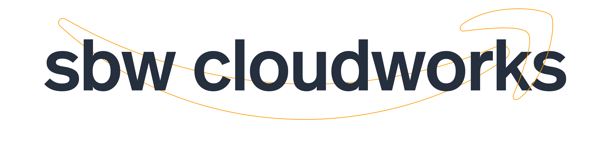
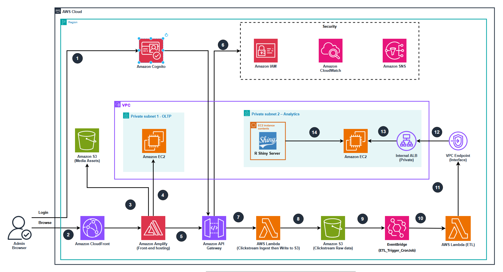

## Technical Architecture Diagram

# 📊 Clickstream Analytics Platform for E-Commerce  
Batch-based ETL • AWS Serverless • Data Warehouse • R Shiny Analytics

## 🏆 Overview
This project implements a **Batch Clickstream Analytics Platform** for an e-commerce website
selling computer products.  
The system collects user behavior events, stores raw JSON in S3, processes data using
scheduled ETL (AWS Lambda), and loads analytical data into a **self-managed PostgreSQL Data Warehouse** hosted on EC2.

Analytics dashboards are built using **R Shiny**, running on the same EC2 instance as the Data Warehouse.

The platform is designed with:
- High data security (private subnets, no public DB access)
- Clear separation between OLTP vs Analytics workloads
- Scalable and low-cost AWS serverless components

---

# 🏗️ Architecture Summary

### **1. User-Facing Domain**
- Frontend built using **React/Next.js**
- Hosted on **AWS Amplify Hosting**
- Amplify internally uses:
  - Amazon CloudFront (CDN)
  - Amazon S3 (assets bucket)
- Authentication via **Amazon Cognito User Pool**

---

### **2. Ingestion & Data Lake Domain**
- Frontend sends clickstream JSON events to **Amazon API Gateway (HTTP API)**
- API Gateway → **Lambda Ingest Function**
- Lambda validates and stores raw events into the **S3 Raw Clickstream Bucket**
- **EventBridge Cron** triggers ETL Lambda periodically
- ETL Lambda:
  - Reads raw S3 data
  - Cleans & transforms JSON → SQL-ready rows
  - Inserts data directly into **PostgreSQL Data Warehouse (EC2)**

---

### **3. Analytics & Data Warehouse Domain**

The system uses **two separate EC2 instances**:

#### **EC2 #1 — OLTP Database**
- PostgreSQL database for the e-commerce website
- Stores operational data: users, orders, products, transactions
- Located in **Private Subnet 1 (OLTP)**

#### **EC2 #2 — Data Warehouse + R Shiny**
- PostgreSQL Data Warehouse
- R Shiny Server hosting analytics dashboards
- Located in **Private Subnet 2 (Analytics)**

> Separation ensures analytical workloads do not impact OLTP performance.

---

# 🔐 Networking & Security Design
- Both EC2 instances are deployed in **private subnets**
- No public access to databases
- Lambda runs outside the VPC
- Private connectivity established via:
- Lambda → VPC Interface Endpoint → Internal ALB → EC2 #2 (Data Warehouse)
- IAM roles secure all AWS interactions
- CloudWatch logs monitor API, Lambda, and ETL activity

---

# 📦 S3 Buckets (2 Buckets Only)
1. **Amplify Assets Bucket**  
 Stores static frontend files

2. **Raw Clickstream Data Bucket**  
 Stores raw JSON clickstream events  
 (No "processed" S3 bucket — processed data goes directly to PostgreSQL)

---

# 🔁 Data Flow Summary
1. User visits frontend (Amplify → CloudFront)
2. User logs in via Cognito (JWT issued)
3. Frontend sends clickstream events to API Gateway
4. API Gateway → Lambda Ingest
5. Lambda writes raw events → S3 Raw Bucket
6. EventBridge triggers ETL Lambda
7. ETL Lambda reads S3 raw files
8. Transforms JSON → SQL rows
9. Connects privately into EC2 Data Warehouse
10. Inserts processed data into PostgreSQL DW
11. R Shiny reads DW and renders analytics dashboard
12. Admin accesses dashboard for insights

---

# 🧩 Key Features
- Lightweight and scalable clickstream ingestion
- Secure private-only analytical backend
- R Shiny for interactive dashboards
- Clear separation of Operational DB vs Analytics DB
- Fully serverless ETL pipeline

---

# 🛠️ Tech Stack

### **AWS Services**
- AWS Amplify Hosting  
- Amazon CloudFront  
- Amazon Cognito  
- Amazon S3  
- Amazon API Gateway  
- AWS Lambda  
- Amazon EventBridge  
- Amazon EC2  
- AWS IAM  
- Amazon CloudWatch  

### **Databases**
- PostgreSQL (OLTP – EC2 #1)  
- PostgreSQL (Data Warehouse – EC2 #2)

### **Analytics**
- R Shiny Server  
- Custom SQL transformation logic  

---

# 🚀 Deployment Notes
- No NAT Gateway needed
- All databases remain private (no public endpoints)
- Lambda functions communicate to EC2 only through VPC Endpoint + ALB

---

