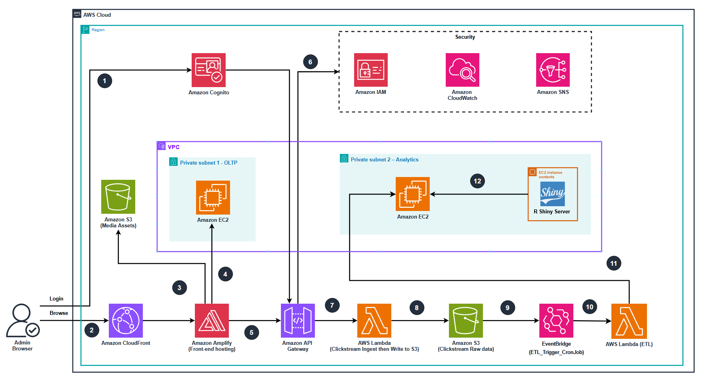

# SBW CloudWorks

## Technical Architecture Diagram

### 1. Network Infrastructure

The environment is deployed inside an Amazon Virtual Private Cloud (VPC) consisting of:

* **Public Layer**

  * AWS Amplify Hosting for the e-commerce frontend, integrated with Amazon CloudFront as the global CDN.

  * API Gateway for handling ingest traffic from the frontend.

* **Private Subnet 1 – OLTP Layer**

  * EC2 instance hosting the operational transactional database for the e-commerce website.

* **Private Subnet 2 – Analytics Layer**

  * EC2 instance hosting the Data Warehouse.

  * EC2 instance hosting the R Shiny Server for dashboard visualizations.

* **VPC Gateway Endpoint for Amazon S3**, ensuring private connectivity from Lambda and EC2 to S3 without requiring a NAT Gateway.

---

### 2. Data and Process Flow

The system processes clickstream data through the following workflow:

1. **User Interaction**  
    Users access the website through **Amplify \+ CloudFront**, which delivers static web assets with low latency.

2. **Event Collection**  
    A JavaScript SDK embedded in the frontend sends user interaction events (clicks, views, searches) to **Amazon API Gateway**.

3. **Ingestion Layer**  
    API Gateway invokes an **AWS Lambda** function that validates and stores raw clickstream data into **Amazon S3 (Raw Layer)**.

4. **Batch Processing (ETL)**

   * **Amazon EventBridge** triggers the ETL Lambda function every 60 minutes.

   * The Lambda function reads raw logs from S3, performs cleaning, transformation, and normalization.

   * Processed data is written to **S3 Processed Layer** and loaded into the **EC2 Data Warehouse**.

5. **Analytics & Visualization**  
    An **R Shiny Server** on EC2 queries the Data Warehouse to provide dashboards displaying product popularity, customer behavior, sales funnels, and traffic trends.

---

### 3. Software Services and Components

The architecture includes the following AWS services:

* **Frontend & Delivery**: AWS Amplify, Amazon CloudFront

* **Data Ingestion**: Amazon API Gateway, AWS Lambda

* **Storage**: Amazon S3 (Media Assets, Raw Data, Processed Data)

* **ETL & Scheduling**: AWS Lambda, Amazon EventBridge

* **Compute (Analytics)**: Amazon EC2 (Data Warehouse, R Shiny Server)

* **Security & Access Control**: Amazon Cognito, AWS Identity and Access Management (IAM)

* **Monitoring & Logging**: Amazon CloudWatch, Amazon SNS

* **Networking**: VPC, Subnets, S3 VPC Endpoint, Security Groups

---

### 4. Integration and Security Controls

* **Authentication & Authorization**: Amazon Cognito manages secure user sign-in and token-based access to APIs.

* **Least-privilege IAM Policies** are enforced for Lambda, API Gateway, EC2, and S3 access.

* **Operational Metrics & Alerts** are configured in Amazon CloudWatch and forwarded to Amazon SNS.

* **Private subnets** ensure no direct public access to the Data Warehouse or Shiny workloads.

* **S3 VPC Endpoint** ensures internal-only communication without exposing resources to the internet.
